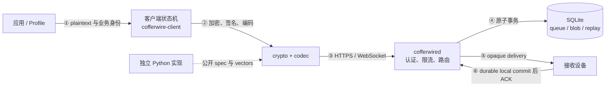

# Cofferwire

Cofferwire 是一组面向私密异步消息和加密对象投递的开放协议，以及相互独立验证的
Rust/Python 实现。客户端负责端到端保护与应用状态，Relay 只负责可替换的持久可用性。

> 工程设计以 [`docs/detailed_design/`](docs/detailed_design/00_概述.md) 为唯一正源
> （SSoT）；线上字节和规范性行为以 [`docs/spec/`](docs/spec/README.md) 为准。本 README 仅作
> 工程总览与快速上手。

## 概述

发送设备先生成稳定消息标识、加密应用内容并签署 Relay 命令；daemon 在资源边界内
严格解码和认证，把不透明 payload 原子写入 SQLite；接收设备取回数据后必须先认证、
解密并持久应用，最后才发送删除 ACK。**每台接收设备拥有独立队列，多设备 fan-out
和业务冲突不进入 Relay。**



详细架构、数据流和模块职责见
[`docs/detailed_design/00_概述.md`](docs/detailed_design/00_概述.md)。

### 主要功能

| 对外能力 | 功能 | 实现入口 | 状态 |
|---|---|---|---|
| queue-v1 | 异步小消息、幂等重试、持久投递与 ACK | [`cofferwire-client`](crates/cofferwire-client/src/lib.rs)、[`cofferwired`](apps/cofferwired/src/lib.rs) | scope 已冻结，仍处于发布前阶段 |
| `cofferwire-blob/1` | 分块加密、可恢复上传、原子 commit、角色 capability | [`client/blob.rs`](crates/cofferwire-client/src/blob.rs) | 独立 draft profile |
| `receipts/1` | 端到端签名的 `receipt.applied` | [`client/receipt.rs`](crates/cofferwire-client/src/receipt.rs) | 独立 draft profile |
| `cofferwire-offline/1` | 本地 invitation/recovery bundle 与 relay replacement | [`client/offline.rs`](crates/cofferwire-client/src/offline.rs) | 独立 draft profile |
| `family-tree/1` | application object、冲突、history bundle 与多设备约定 | [`profiles/family-tree-v1.md`](profiles/family-tree-v1.md) | 应用 profile；真实试点待外部执行 |
| 独立互操作 | Rust/Python client 与 relay 四组合验证 | [`run_interop_matrix.py`](scripts/run_interop_matrix.py) | 当前证据通过 |
| 发布门禁 | 可复现工件、SBOM、checksums 与签名验证 | [`90_部署与运维.md`](docs/detailed_design/90_部署与运维.md) | 正式 1.0 受真实试点和外审阻塞 |

> 当前代码不是生产就绪的安全产品。项目尚未完成真实三设备/双独立 Relay 试点和外部
> 密码学协议审查；不要用于敏感或不可替代数据。准确支持范围见
> [`SECURITY.md`](SECURITY.md)。

## 运行要件

| 项 | 要件 |
|---|---|
| Rust | workspace `rust-version` 指定的稳定工具链；nightly 仅运行 fuzz |
| Python | 独立实现 `pyproject.toml` 声明的版本和 `cryptography` 依赖 |
| 存储 | bundled SQLite；无需外部数据库服务 |
| 网络 | daemon 使用运营者提供证书的 TLS/HTTPS 与 WebSocket |
| 硬件 | 无专用硬件要求；当前自动化主要验证 Linux x86_64 |

具体环境和配置入口见
[`80_配置参考.md`](docs/detailed_design/80_配置参考.md)；部署边界见
[`90_部署与运维.md`](docs/detailed_design/90_部署与运维.md)。

## 快速开始

以下命令完成依赖解析、全 workspace 测试和严格静态检查：

```sh
git clone https://github.com/seagochen/cofferwire.git
cd cofferwire
rustup toolchain install 1.84 --component clippy,rustfmt
cargo test --workspace
cargo clippy --workspace --all-targets -- -D warnings
cargo fmt --all -- --check
```

运行独立实现与四组合互操作：

```sh
python3 -m venv .venv
. .venv/bin/activate
python -m pip install 'cryptography>=44,<47'
python3 -m unittest discover -s independent/python/tests -v
python3 scripts/run_interop_matrix.py --output /tmp/interop-matrix-v1.json
```

启动网络 daemon 还需可验证的 TLS certificate/private key 和 SQLite 路径；完整命令、
接口和生产注意事项见 [`70_外部接口.md`](docs/detailed_design/70_外部接口.md) 与
[`90_部署与运维.md`](docs/detailed_design/90_部署与运维.md)。

## 文档

| 文档 | 内容 |
|---|---|
| [`docs/`](docs/README.md) | 全部设计、证据、运维、安全和发布文档索引 |
| [`docs/detailed_design/`](docs/detailed_design/00_概述.md) | 详细设计书（SSoT） |
| [`docs/spec/`](docs/spec/README.md) | 规范性协议文本、CDDL 与 identifier registry |
| [`TESTING.md`](TESTING.md) | 测试策略和十项 release gates |
| [`SECURITY.md`](SECURITY.md) | 支持状态、私密报告渠道与响应目标 |
| [`PLAN.md`](PLAN.md) | 项目使命、设计原则和里程碑背景 |

## 项目结构

```text
apps/cofferwired/          HTTPS/WebSocket reference Relay daemon
crates/                    Rust types, codec, crypto, client, relay and tests
independent/python/        clean-room queue-v1 implementation
profiles/                  application-layer profiles
vectors/                   language-neutral public fixtures
conformance/               requirement registry and coverage report
fuzz/                      hostile-input targets
scripts/                   interop, evidence, review and release tools
docs/                      protocol and engineering documentation
  spec/                    normative protocol specification
  detailed_design/         implementation design SSoT
```

## 相关说明

- queue-v1 与 blob/receipt/offline profile 的 identifier space 相互独立；支持其中一个不
  表示支持其他 profile。
- 设计说明以 `docs/detailed_design/` 为准，wire 规则以 `docs/spec/` 为准，具体配置值与
  默认值以源码和机器可读运营限制为准。
- 未完成工作和发布状态只在 GitHub Issues 管理，不在仓库维护第二份任务清单。
- 所有源码和贡献按 [Apache License 2.0](LICENSE) 授权。
