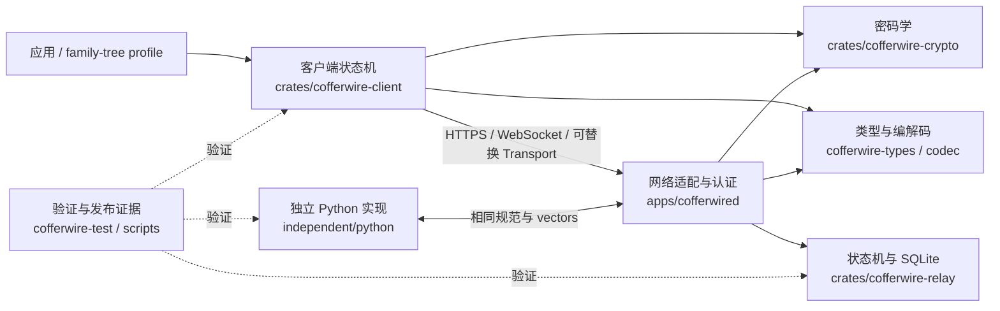

# 详细设计书 Cofferwire 概述

本书群按实现边界拆分，由本文件作为入口。它描述工程结构与实现契约；线上字节、
标识符和规范性行为的权威来源是 [`../spec/`](../spec/README.md)。两者出现冲突
时，协议实现必须先满足规范，再同步修正设计书。

## 0. 关于本书群

### 0.1 文档构成

| 文件 | 范围 |
|---|---|
| `00_概述.md`（本书） | 追溯、全貌、系统要件与移交 |
| [`05_术语表.md`](05_术语表.md) | 专有术语与边界 |
| [`10_通用设计.md`](10_通用设计.md) | 横切数据、安全、错误、性能和测试策略 |
| [`20_协议模型与编解码.md`](20_协议模型与编解码.md) | `cofferwire-types` 与 `cofferwire-codec` |
| [`30_密码学.md`](30_密码学.md) | `cofferwire-crypto` |
| [`40_客户端状态机.md`](40_客户端状态机.md) | `cofferwire-client` |
| [`50_Relay与守护进程.md`](50_Relay与守护进程.md) | `cofferwire-relay` 与 `cofferwired` |
| [`60_一致性验证与独立实现.md`](60_一致性验证与独立实现.md) | 测试、vectors、Python 独立实现和证据工具 |
| [`70_外部接口.md`](70_外部接口.md) | 网络、WebSocket 与测试传输接口 |
| [`80_配置参考.md`](80_配置参考.md) | CLI 参数和环境变量入口 |
| [`90_部署与运维.md`](90_部署与运维.md) | 构建、运行、恢复、安全和发布 |

### 0.2 编辑方针

- 类型、函数和配置只引用代码路径与符号；实现细节以源码为准。
- 跨模块契约只在一个子文档展开，其他位置使用链接。
- 版本由 Git 历史和 tag 管理，不写入设计文档文件名。
- 任务状态由 GitHub Issues 管理；本书只记录稳定设计和已知边界。

## 1. 参照文档与追溯性

### 1.1 参照文档

| 区分 | 文档 | 作用 |
|---|---|---|
| 工程入口 | [`../../README.md`](../../README.md) | 总览和快速开始 |
| 项目计划 | [`../../PLAN.md`](../../PLAN.md) | 里程碑和范围背景，不承载任务状态 |
| 协议规范 | [`../spec/README.md`](../spec/README.md) | 规范性协议契约和 identifier registry |
| 测试策略 | [`../../TESTING.md`](../../TESTING.md) | 可验证性与 release gates |
| 安全政策 | [`../../SECURITY.md`](../../SECURITY.md) | 支持范围与私密报告渠道 |
| 运营限制 | [`../../conformance/evidence/operational-limits-v1.json`](../../conformance/evidence/operational-limits-v1.json) | 与编译常量交叉校验的机器可读限制 |

### 1.2 需求与设计追溯

| 需求域 | 规范 / 证据 | 设计位置 |
|---|---|---|
| queue-v1 | `docs/spec/01`–`06`、`09`、`10` | [`20`](20_协议模型与编解码.md)、[`30`](30_密码学.md)、[`50`](50_Relay与守护进程.md) |
| blob/1 | `docs/spec/07-*`、公开 vectors | [`20`](20_协议模型与编解码.md)、[`30`](30_密码学.md)、[`40`](40_客户端状态机.md)、[`50`](50_Relay与守护进程.md) |
| receipts/offline | `docs/spec/08`、`docs/spec/13` | [`30`](30_密码学.md)、[`40`](40_客户端状态机.md) |
| family-tree profile | `profiles/family-tree-v1.md` | [`40`](40_客户端状态机.md)、[`60`](60_一致性验证与独立实现.md) |
| 安全、隐私、运营 | `docs/spec/02`、`11`、`12` | [`10`](10_通用设计.md)、[`90`](90_部署与运维.md) |
| 发布质量 | `TESTING.md` §12、conformance evidence | [`60`](60_一致性验证与独立实现.md)、[`90`](90_部署与运维.md) |

### 1.3 核心架构决策：queue-v1 范围冻结

queue-v1 的不可变 scope revision 是 `CW-SCOPE-QUEUE-V1-2026-09-06`。版本 1 只表示由
[`docs/spec/10-versioning.md`](../spec/10-versioning.md) 登记的小消息 queue profile，不包含
blob transfer、application receipt 或 offline bundle。把这些能力加入同一 namespace，会使
既有 decoder 对相同版本产生不兼容解释。

因此 `cofferwire-blob/1` 使用独立协商的命令、状态、media type 和 transport identifier；
receipt 与 offline bundle 同样拥有独立 application/profile identifier。应用可以组合使用
这些 profile，但支持其中一个绝不暗示支持另一个，也不得重新解释 queue-v1 allocation。

这一拆分保留了已由 public vectors 和互操作测试覆盖的 bounded queue contract，使 blob 的
resumability、padding、availability 和 capability lifecycle 能独立演进，并允许部署只提供
小消息 queue。其直接后果是：

- 改变 queue-v1 canonical bytes、认证覆盖、字段含义或 failure semantics 必须分配新版本；
- blob、receipt、offline profile 分别达到 conformance，不会静默扩展 queue-v1；
- 互操作、外审和发布证据必须明确列出接受测试的 profile 与 scope revision；
- 某个 release 是否包含可选 profile，由其 release manifest 明示，而不是由版本号隐含。

## 2. 系统概述

### 2.1 概述

Cofferwire 为不要求双方同时在线的应用提供私密消息和加密对象传递。发送设备在本地
完成端到端加密并对 relay 命令签名；relay 只验证协议权限、持久化不透明字节并提供
至少一次投递；接收设备必须先认证、解密并持久提交，再发送删除 ACK。

**Relay 是可替换的可用性服务，不是内容、身份或应用状态的信任根。** 每个接收设备
拥有独立队列，多设备 fan-out、冲突和应用回执都停留在客户端/应用层。

### 2.2 主要功能

| 功能 | 实现入口 | 设计 |
|---|---|---|
| 严格 queue/blob frame | [`cofferwire-codec`](../../crates/cofferwire-codec/src/lib.rs) | [`20`](20_协议模型与编解码.md) |
| 命令认证与端到端保护 | [`cofferwire-crypto`](../../crates/cofferwire-crypto/src/lib.rs) | [`30`](30_密码学.md) |
| 可恢复发送与收件提交 | [`cofferwire-client`](../../crates/cofferwire-client/src/lib.rs) | [`40`](40_客户端状态机.md) |
| SQLite queue/blob relay | [`DurableRelay`](../../crates/cofferwire-relay/src/durable.rs) | [`50`](50_Relay与守护进程.md) |
| HTTPS/WebSocket daemon | [`router`](../../apps/cofferwired/src/lib.rs) | [`50`](50_Relay与守护进程.md)、[`70`](70_外部接口.md) |
| 独立互操作与发布证据 | [`scripts/`](../../scripts) | [`60`](60_一致性验证与独立实现.md) |

### 2.3 全体构成



### 2.4 模块一览

| 模块 | 源码 | 职责 | 详细 |
|---|---|---|---|
| 协议模型 | [`crates/cofferwire-types/`](../../crates/cofferwire-types) | 合法状态与边界类型 | [`20`](20_协议模型与编解码.md) |
| 编解码 | [`crates/cofferwire-codec/`](../../crates/cofferwire-codec) | canonical CBOR 与严格拒绝 | [`20`](20_协议模型与编解码.md) |
| 密码学 | [`crates/cofferwire-crypto/`](../../crates/cofferwire-crypto) | 认证、加密、blob 和 receipt | [`30`](30_密码学.md) |
| 客户端 | [`crates/cofferwire-client/`](../../crates/cofferwire-client) | 重试、持久化顺序与恢复 | [`40`](40_客户端状态机.md) |
| Relay | [`crates/cofferwire-relay/`](../../crates/cofferwire-relay) | 传输无关状态机与事务存储 | [`50`](50_Relay与守护进程.md) |
| Daemon | [`apps/cofferwired/`](../../apps/cofferwired) | TLS/HTTP/WS、认证、限流和路由 | [`50`](50_Relay与守护进程.md) |
| 验证体系 | [`crates/cofferwire-test/`](../../crates/cofferwire-test)、[`scripts/`](../../scripts) | traceability、互操作、证据与发布 | [`60`](60_一致性验证与独立实现.md) |
| 独立实现 | [`independent/python/`](../../independent/python) | 不依赖 Rust 的 queue-v1 实现 | [`60`](60_一致性验证与独立实现.md) |

### 2.5 目录构成

```text
apps/cofferwired/          reference network relay daemon
crates/                    Rust protocol, crypto, client, relay and test crates
independent/python/        clean-room queue-v1 implementation
docs/spec/                      normative protocol specification
profiles/                  application profiles outside core identifiers
vectors/                   language-neutral public vectors
conformance/               requirement registry and coverage report
fuzz/                      libFuzzer targets and seed provenance
scripts/                   evidence, interoperability and release tooling
docs/                      detailed design and ignored temporary experiment workspace
```

## 3. 系统要件

### 3.1 硬件

协议库没有专用硬件要求。当前验证环境为 Linux x86_64；真实多设备和双独立 relay
试点的设备/运营要求见 [`90_部署与运维.md`](90_部署与运维.md)。

### 3.2 软件

| 项目 | 要件 |
|---|---|
| Rust | workspace `rust-version` 指定的稳定工具链；nightly 仅用于 fuzz |
| Python | 独立实现声明的最低版本；CI 版本见 workflow |
| 存储 | `rusqlite` bundled SQLite，不依赖外部数据库服务 |
| 网络 | daemon 提供 TLS 上的 HTTPS/WebSocket；证书由运营者提供 |
| 构建 | Cargo workspace，依赖版本由 `Cargo.lock` 固定 |

具体一次信息源见 [`../../Cargo.toml`](../../Cargo.toml)、
[`../../independent/python/pyproject.toml`](../../independent/python/pyproject.toml) 和
[`../../.github/workflows/`](../../.github/workflows)。

## 16. 向下一工程的移交

### 16.1 实现与测试工程

修改 wire 或 identifier 前先更新规范和 vectors；修改模块边界、持久化语义或公开接口
时同步本书群。完整验证入口见 [`60_一致性验证与独立实现.md`](60_一致性验证与独立实现.md)。

### 16.2 未解决课题

未完成工作不在本书维护状态。当前发布相关事项以 GitHub
[#25](https://github.com/seagochen/cofferwire/issues/25)、
[#27](https://github.com/seagochen/cofferwire/issues/27)、
[#28](https://github.com/seagochen/cofferwire/issues/28) 为准。
