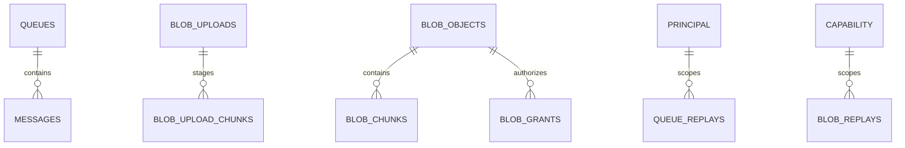

# 通用设计

## 1. 分层与依赖方向

底层 `cofferwire-types` 不依赖传输、密码学和存储；codec 只依赖 types；crypto
只依赖 types；client 组合 types/codec/crypto 并通过 trait 隔离传输与本地持久化；
relay 承担语义和 SQLite；daemon 在最外层组合认证、路由和资源控制。应用 profile
不能向 core relay 注入业务语义。

## 2. 数据模型

SQLite schema 的一次信息源是
[`durable.rs` 的 `SCHEMA`](../../crates/cofferwire-relay/src/durable.rs)。下图只表达实体
职责和关系，不复制列定义。

| 实体组 | 契约 |
|---|---|
| queues/messages | 队列配置、顺序投递、到期和已投递状态在事务中一致 |
| blob uploads/chunks | 未完成上传保持不可见，commit 后才形成 immutable object |
| blob objects/grants | ciphertext identity 与访问授权分离；删除当前撤销 grant，不承诺物理清除 ciphertext |
| replay records | 认证主体与 RequestId 共同限定重放；effect 与 response 原子提交 |

## 3. 错误处理

- 不可信输入在最接近边界处转为封闭的 protocol status，不能 panic 或携带 secret。
- types 构造器阻止非法内存状态；codec 使用 [`DecodeError`](../../crates/cofferwire-codec/src/error.rs) 区分结构失败。
- crypto 对认证/解密失败保持低信息量；client 的 [`ClientError`](../../crates/cofferwire-client/src/lib.rs) 不携带明文、密钥或 ciphertext。
- durable relay 将 SQLite 失败映射为稳定的 [`StorageErrorKind`](../../crates/cofferwire-relay/src/durable.rs)，但保留 source 供受控诊断。
- daemon 的内部存储/过载失败映射为传输级不可用，业务拒绝仍返回协议 response。

## 4. 安全与隐私

- 所有网络输入先受 frame/body/连接/并发边界约束，再进行解析和认证；认证之后才进入业务状态机。
- queue principal 和 blob capability 分开验证并分别限流；实现入口见
  [`RelayService`](../../apps/cofferwired/src/lib.rs) 与
  [`RateLimiter`](../../apps/cofferwired/src/rate_limit.rs)。
- 私钥仅存在于调用方持有的 key wrapper；Debug 实现只暴露 public identity 或结构摘要。
- Relay 可观察 IP、时间、长度、队列和 blob 访问关系；加密不构成匿名性保证。边界见
  [`docs/spec/12`](../spec/12-privacy-considerations.md)。
- 公开 metrics 只允许不带稳定标识符的聚合 bucket；具体应用还必须满足 profile 限制。

## 5. 性能与资源

性能设计优先保证输入工作有界、事务边界明确和重试确定，而不是追求最大吞吐。
frame、payload、chunk、连接、并发、timeout 与限流值的权威实现位置和机器可读映射见
[`operational-limits-v1.json`](../../conformance/evidence/operational-limits-v1.json)；测试
[`operational_limits.rs`](../../apps/cofferwired/tests/operational_limits.rs) 防止文档与
编译常量漂移。

## 6. 实现约束

- workspace 禁止 unsafe；lint policy 见 [`Cargo.toml`](../../Cargo.toml)。
- queue-v1 canonical bytes 或既有 identifier 的语义变化必须分配新版本。
- 请求重试必须复用完全相同的已认证字节；不得重新加密或更换 RequestId。
- ACK 必须位于本地 durable commit 之后；application receipt 不替代 ACK。
- SQLite schema 只允许显式向前迁移；高于当前实现的 schema 必须无修改拒绝。

## 7. 测试方针

测试从规范 ID 出发，覆盖 vectors、独立实现互操作、fuzz、模型比较、事务故障、
真实子进程崩溃和发布工件。完整分层与命令见
[`60_一致性验证与独立实现.md`](60_一致性验证与独立实现.md) 和
[`../../TESTING.md`](../../TESTING.md)。

## 8. 依赖库

版本和 feature 的一次信息源是各 `Cargo.toml` 与 `Cargo.lock`。

| 库族 | 用途 | 使用模块 |
|---|---|---|
| `ed25519-dalek`、`hpke`、`sha2`、AEAD/HKDF | 标准密码学 primitive | crypto、test |
| `rusqlite` | bundled SQLite 事务持久化 | relay、daemon |
| `axum`、`axum-server`、`tower-http`、Tokio | HTTPS/WebSocket、TLS 与资源 layer | daemon |
| `serde_json`、`cddl` | vectors/evidence 与结构一致性验证 | test、daemon tests |
| Python `cryptography` | clean-room Ed25519/HPKE 相关 primitive | independent implementation |
| `libfuzzer-sys` | hostile-input fuzz target | fuzz workspace |
