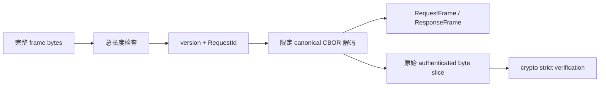

# 协议模型与编解码

**源码**：[`crates/cofferwire-types/`](../../crates/cofferwire-types)、
[`crates/cofferwire-codec/`](../../crates/cofferwire-codec) 
**运行位置**：client、daemon、测试与独立互操作边界

## 1. 职责

types 定义合法协议状态、标识符和大小不变量；codec 在这些类型与 canonical wire bytes
之间作确定性转换。它们不执行密码学、不访问 SQLite，也不决定重试或应用语义。

## 2. 类型模型

- queue 请求/响应聚合在 [`body.rs`](../../crates/cofferwire-types/src/body.rs)，命令和状态分别由 [`command.rs`](../../crates/cofferwire-types/src/command.rs)、[`status.rs`](../../crates/cofferwire-types/src/status.rs) 约束。
- 固定宽度标识位于 [`ids.rs`](../../crates/cofferwire-types/src/ids.rs)；opaque payload/auth 使用隐藏内容的 Debug 表示。
- blob/1 使用独立的 command、status、manifest、capability 和 frame 类型，位于 [`blob.rs`](../../crates/cofferwire-types/src/blob.rs)，不扩展 queue-v1 namespace。
- 所有公开构造器在值进入系统时验证范围，使后续 encoder 不需重复决定合法性。

## 3. Queue 编解码流程

[`decode_request`](../../crates/cofferwire-codec/src/lib.rs) 返回 typed frame 和直接借用输入
的认证字节范围。认证因此绑定收到的原始 canonical bytes，不依赖“解码后重新编码”。
[`decode_response`](../../crates/cofferwire-codec/src/lib.rs) 同样要求完整消费输入，拒绝
trailing、非 canonical、未知 discriminator 和不合法 body 组合。

## 4. Blob 编解码

blob frame 的实现集中在
[`cofferwire-codec/src/blob.rs`](../../crates/cofferwire-codec/src/blob.rs)。它使用独立
endpoint namespace 和 authenticated bytes，严格验证 manifest、chunk 与各角色 capability
字段。完整 wire 结构只在 [`docs/spec/07-blobs.cddl`](../spec/07-blobs.cddl) 定义。

## 5. 版本边界

queue-v1 的版本、command、status、algorithm 和 transport identifier 由
[`docs/spec/10-versioning.md`](../spec/10-versioning.md) 管理。未知版本只读取固定 preamble
所允许的信息后 fail closed；codec 不猜测其他版本 payload。blob、receipt 和 offline
profile 的版本域与 queue-v1 分离。

## 6. 验证

- [`codec.rs`](../../crates/cofferwire-codec/tests/codec.rs) 检查所有 frame round-trip、边界和 hostile encoding。
- [`wire_cddl.rs`](../../crates/cofferwire-test/tests/wire_cddl.rs) 将实际 frame 与公开 CDDL 对照。
- [`vectors/`](../../vectors) 固定跨语言 exact bytes；fuzz target 直接攻击 decoder 边界。
