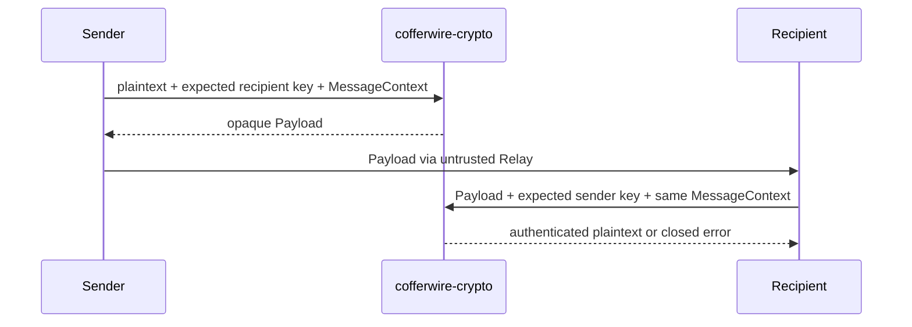

# 密码学

**源码**：[`crates/cofferwire-crypto/`](../../crates/cofferwire-crypto) 
**运行位置**：发送/接收 client 与 daemon 认证边界

## 1. 职责

该模块组合已标准化 primitive，提供 queue 命令认证、应用消息端到端保护、blob 内容
保护、角色 capability 签名和 application receipt。它不生成业务身份关系、不存储密钥、
不负责网络和 Relay durability，也不声称隐藏流量元数据。

## 2. Queue 命令认证

[`RelaySigningKey::sign_request`](../../crates/cofferwire-crypto/src/lib.rs) 对 codec 提供的
原始 authenticated bytes 加域分隔后签名；
[`verify_request`](../../crates/cofferwire-crypto/src/lib.rs) 同时验证 profile/algorithm 和
Ed25519 strict signature。Principal 来自预期队列角色，不从未认证内容中推断。

## 3. 应用消息保护

[`seal_message`](../../crates/cofferwire-crypto/src/lib.rs) 与
[`open_message`](../../crates/cofferwire-crypto/src/lib.rs) 使用 authenticated HPKE，并把
QueueId、双方 Principal 和 MessageId 组成的 [`MessageContext`](../../crates/cofferwire-crypto/src/lib.rs)
绑定到 key schedule/AAD。失败不会返回部分明文；profile mismatch 与通用解密失败均不
包含 secret-bearing bytes。

## 4. Blob、Receipt 与离线 bundle

- [`crypto/blob.rs`](../../crates/cofferwire-crypto/src/blob.rs) 将 immutable ciphertext
  identity、chunk integrity 和四类 capability 分离；client orchestration 见 [`40`](40_客户端状态机.md)。
- [`crypto/receipt.rs`](../../crates/cofferwire-crypto/src/receipt.rs) 对 confirmed object 和
  exact applied-content digest 签名；其域与 relay request 签名分离。
- offline bundle 复用应用消息 HPKE 构造，不另造 primitive；封装和身份恢复位于
  [`client/offline.rs`](../../crates/cofferwire-client/src/offline.rs)。

## 5. 密钥边界

- 生产随机源由调用方以 `CryptoRng + RngCore` 提供；固定 seed/IKM 构造只用于安全加载和 vectors。
- secret key wrapper 的 Debug 只显示 public counterpart，不输出 seed 或私钥。
- Relay 永不接收应用解密 key；角色 capability 泄露的后果只限对应 blob 操作范围。
- 密钥存储、轮换和备份属于应用/运营责任，当前 reference daemon 不提供密钥管理服务。

## 6. 证据

规范契约见 [`docs/spec/04`](../spec/04-cryptographic-profile.md)、
[`docs/spec/07`](../spec/07-blobs.md)、[`docs/spec/08`](../spec/08-receipts.md)；exact vector
验证位于 [`cofferwire-crypto/tests`](../../crates/cofferwire-crypto/tests) 和
[`cofferwire-test/tests`](../../crates/cofferwire-test/tests)。外部审查范围与交付规则见
[`90_部署与运维.md`](90_部署与运维.md)。
