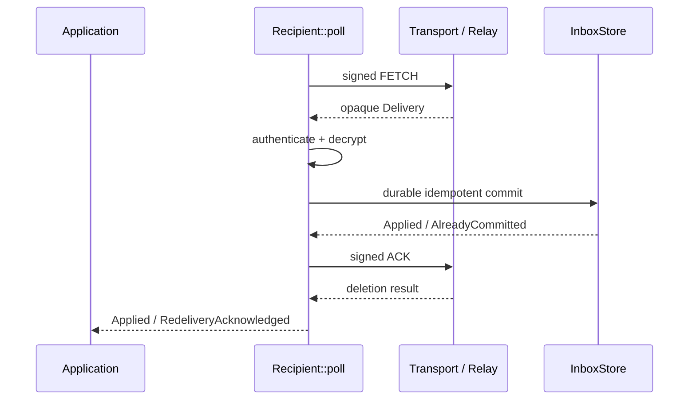

# 客户端状态机

**源码**：[`crates/cofferwire-client/`](../../crates/cofferwire-client) 
**运行位置**：嵌入应用进程；不提供独立 UI 或账户服务

## 1. 职责

客户端模块把 codec、crypto 和应用提供的持久化/传输接口组合成可恢复状态机。它确保
SEND exact retry、接收端 authenticate/decrypt/commit/ACK 顺序、blob 分块恢复、receipt
验证去重以及 offline bundle 导入。它不实现具体 HTTP client、具体数据库或 family-tree UI。

## 2. 可替换边界

| 接口 | 调用方保证 | 状态机保证 |
|---|---|---|
| [`Transport`](../../crates/cofferwire-client/src/lib.rs) | 一次移动一个完整 frame，失败时不伪造 response | 不依赖连接顺序或 transport identity |
| [`RequestIdSource`](../../crates/cofferwire-client/src/lib.rs) | 同一认证作用域不为不同请求复用 ID | retry 保留原 ID |
| [`InboxStore`](../../crates/cofferwire-client/src/lib.rs) | 返回成功即 durable 且按 MessageId 幂等 | 成功之前不发送 ACK |
| [`ReceiptStore`](../../crates/cofferwire-client/src/receipt.rs) | 按 confirmed object 幂等记录 | 验签、对象和 content digest 通过后才记录 |
| [`BundleStore`](../../crates/cofferwire-client/src/offline.rs) | durable 去重并拒绝角色身份冲突 | open/认证成功后才导入 |

## 3. 发送流程

[`Sender::prepare`](../../crates/cofferwire-client/src/lib.rs) 只加密和签名一次，产生可持久
保存的 [`PreparedSend`](../../crates/cofferwire-client/src/lib.rs)。应用应先写入 outbox，
再调用 [`Sender::send`](../../crates/cofferwire-client/src/lib.rs)；ambiguous transport
failure 后恢复同一 bytes，而不是重新 prepare。

## 4. 接收流程

若 decrypt 或 commit 失败，ACK 不发生；若 commit 后 ACK response 丢失，redelivery 由
InboxStore 去重后再次 ACK，不重复应用。

## 5. Blob 生命周期

[`PreparedBlob`](../../crates/cofferwire-client/src/blob.rs) 固定密文、manifest、BlobId 和
capabilities；[`BlobUploader::advance`](../../crates/cofferwire-client/src/blob.rs) 将 begin、
各 chunk 与 commit 拆成可重试转换；[`download_blob`](../../crates/cofferwire-client/src/blob.rs)
只有在 manifest、所有 chunk 和最终内容身份一致时返回明文。

`BlobUploader` 持有 owned、可恢复状态。每次网络 exchange 前先通过 `BlobUploadStore`
持久提交包含 exact authenticated frame 的 secret-bearing snapshot；验证响应后也必须先
持久提交下一 stage 才返回成功。若第二次提交失败，内存状态回退到旧 pending frame。
恢复时调用方同时提供独立保存的非秘密 `BlobUploadIdentity`，防止 snapshot 被替换为另一
对象或 capability。snapshot 含 object/capability key material，只能进入受保护本地存储，
不能写入日志或公开证据。

## 6. Receipt 与离线恢复

[`verify_and_record_applied_receipt`](../../crates/cofferwire-client/src/receipt.rs) 同时绑定
预期 signer、ConfirmedObject 和可选 exact content。offline 模块的
[`seal_bundle`](../../crates/cofferwire-client/src/offline.rs)、[`open_bundle`](../../crates/cofferwire-client/src/offline.rs)
和 [`open_and_record_bundle`](../../crates/cofferwire-client/src/offline.rs) 负责 relay hints、
own identity recovery 与 durable import；bundle 永不发送到 Relay。

## 7. Application profile 边界

每个设备拥有独立接收队列，fan-out 由应用逐队列 SEND。family-tree object/revision、冲突
和 history bundle 的契约见 [`profiles/family-tree-v1.md`](../../profiles/family-tree-v1.md)；
core client 不解析这些业务字段。
