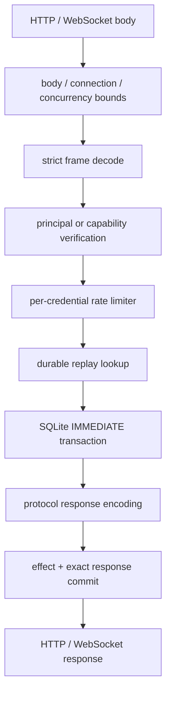

# Relay 与守护进程

**源码**：[`crates/cofferwire-relay/`](../../crates/cofferwire-relay)、
[`apps/cofferwired/`](../../apps/cofferwired) 
**运行进程**：`cofferwired` 或嵌入测试/独立 transport 的 relay library

## 1. 职责与边界

relay library 实现 queue/blob 语义和持久化，不进行网络解析或密码学验证；daemon 在
其外层完成 frame decode、角色认证、限流、请求验证、状态调用和 response encode。
两层都把 payload 当作 opaque bytes，不解析 application profile。

## 2. 双实现模型

- [`Relay`](../../crates/cofferwire-relay/src/lib.rs) 是传输无关的内存语义参考，用于快速
  状态和 model comparison。
- [`DurableRelay`](../../crates/cofferwire-relay/src/durable.rs) 是 SQLite 事务实现；queue
  与 blob transaction-scoped 方法供 daemon 把 effect 和 replay response 原子提交。

两者必须对相同已认证命令产生一致语义结果；SQLite 错误不能伪装成业务成功。

## 3. 请求处理链

入口分别为 [`RelayService::exchange_frame_at`](../../apps/cofferwired/src/lib.rs) 和
[`RelayService::exchange_blob_frame_at`](../../apps/cofferwired/src/lib.rs)；生产异步 wrapper
采样 relay time 并把阻塞 SQLite 工作移出 async executor。

## 4. Queue 事务

CREATE、SEND、FETCH、ACK、DELETE 的 transaction 实现位于
[`durable.rs`](../../crates/cofferwire-relay/src/durable.rs)。SEND 成功只在 durable commit
之后返回；FETCH 的 delivered 状态持久化；ACK 验证目标后与删除同事务；DELETE 级联清理
queue messages。相同认证主体和 RequestId 的完全相同请求返回原 response，不同 bytes
返回 replay conflict。

## 5. Blob 事务

实现位于 [`durable_blob.rs`](../../crates/cofferwire-relay/src/durable_blob.rs)。staged upload
在完整 commit 前不可下载；commit 校验 BlobId/manifest/chunks；download、renew、delete
分别要求对应 capability。当前 delete 撤销 grant，但不承诺从数据库物理擦除共享
ciphertext，运营表述必须遵守 [`90_部署与运维.md`](90_部署与运维.md) 的保留与删除边界。

## 6. Schema 与恢复

schema 和迁移的一次信息源是 [`SCHEMA`/`SCHEMA_VERSION`](../../crates/cofferwire-relay/src/durable.rs)。
初始化开启 foreign keys，使用 rollback journal 和 full synchronous durability；未知未来
schema 无修改拒绝。queue/blob replay 与业务 effect 共用 SQLite，daemon 重启后仍保持
exact retry 语义。

## 7. 网络与资源控制

[`router`](../../apps/cofferwired/src/lib.rs) 提供 queue/blob HTTPS 和 WebSocket routes；
[`ConnectionLimit`](../../apps/cofferwired/src/lib.rs)、semaphore、Tower body/timeout layer 和
[`RateLimiter`](../../apps/cofferwired/src/rate_limit.rs) 共同限制资源。具体值不在本设计书
复制，见机器校验的
[`operational-limits-v1.json`](../../conformance/evidence/operational-limits-v1.json)。

## 8. 非职责

daemon 不负责证书签发、用户账户、设备发现、应用 fan-out、内容审查、密钥托管、在线
schema 管理 UI 或多进程共享同一 SQLite 文件的协调。部署责任见 [`90`](90_部署与运维.md)。
